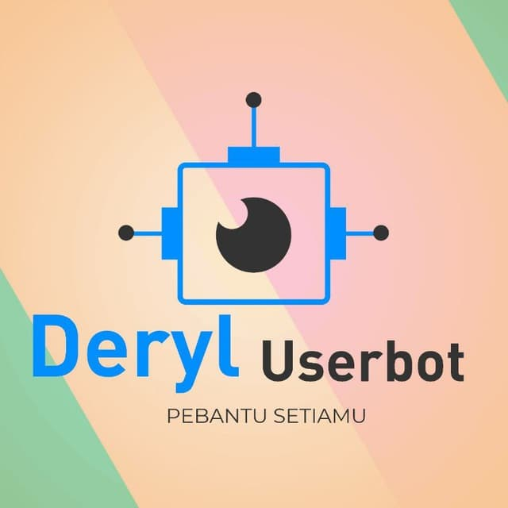

[](ttps://github.com/deryluserbotofficial/userbot)

[](https://github.com/deryluserbotofficial/userbot/issues)
[](https://github.com/deryluserbotofficial/userbot/fork)
[](https://github.com/deryluserbotofficial/userbot/)
[](https://github.com/deryluserbotofficial/userbot/)
[](https://github.com/deryluserbotofficial/userbot)


# UPLOAD

## ⬆️DEPLOY KE SERVER HEROKU

[](https://zee.gl/yuTbJ1)


## APA ITU HEROKU
HEROKU ADALAH SISTEM PEMBUAT APLIKASI WEB AGAR BERJALAN
24 JAM
## KELEMAHAN
```
TERBATAS SAMPAI 5 APP SAJA, JIKA SUDAH 5 APP KITA HARUS MENGHAPUS SALAH SATU APP TERLEBIH DAHULU
```
